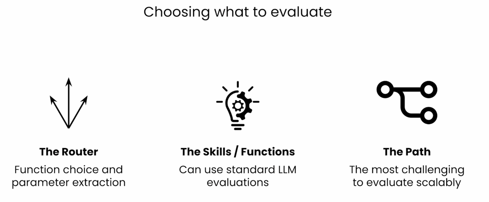
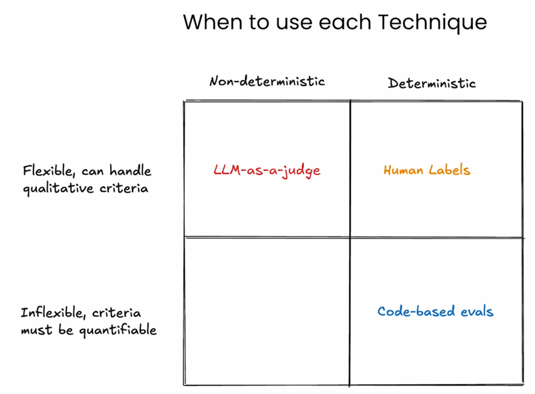
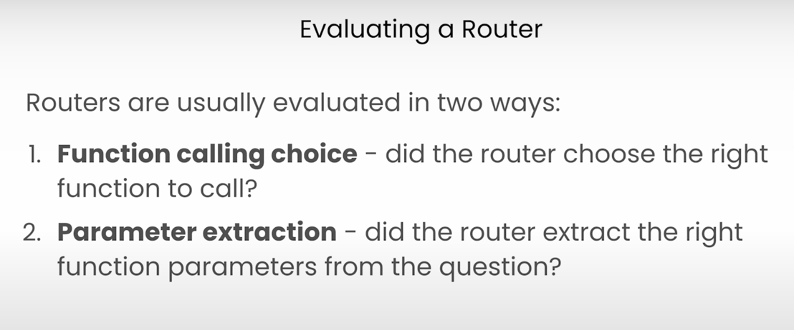
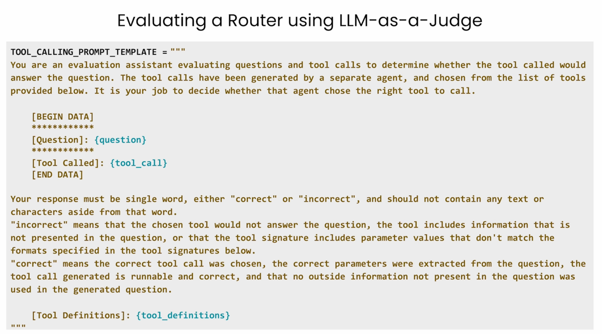
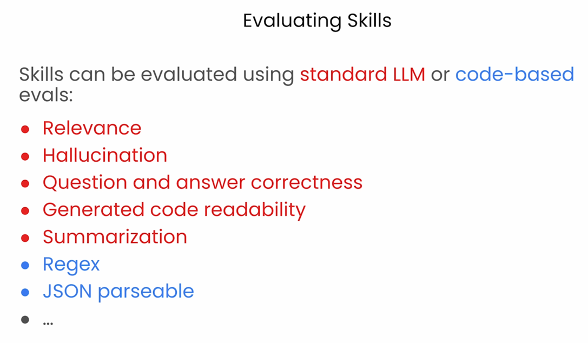
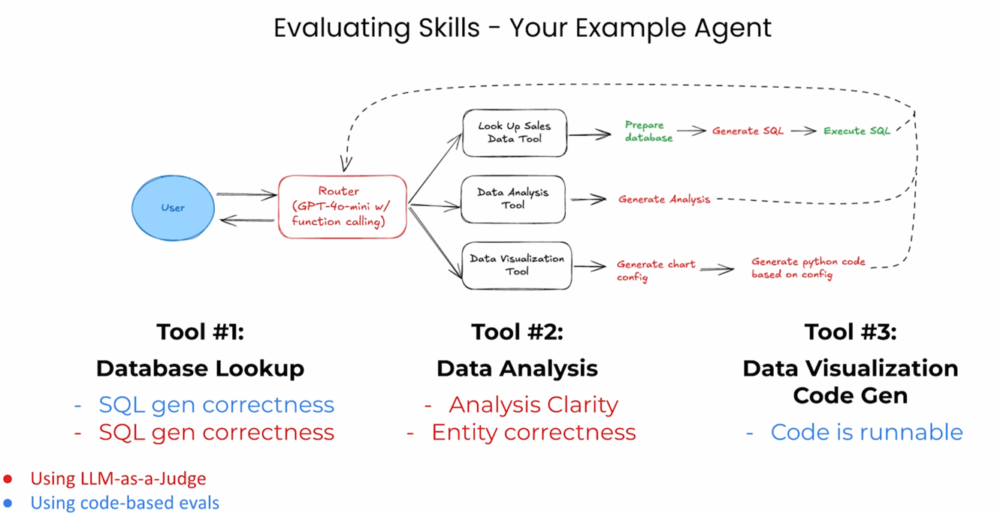

# Arize Phoenix - AI Agent Observability Experiments

This repository contains experiments and learnings from exploring **Arize Phoenix**, an open-source AI observability platform, based on the DeepLearning.AI course on evaluating AI agents.

## Table of Contents

- [Overview](#overview)
- [What is Arize Phoenix?](#what-is-arize-phoenix)
- [Repository Structure](#repository-structure)
- [Setup Instructions](#setup-instructions)
- [Key Concepts](#key-concepts)
  - [Understanding @tracer.tool() vs @tracer.chain()](#understanding-tracertool-vs-tracerchain)
  - [Agent Architecture](#agent-architecture)
  - [Tracing Hierarchy](#tracing-hierarchy)
- [Notebooks](#notebooks)
- [Key Learnings](#key-learnings)
- [Running the Experiments](#running-the-experiments)
- [Additional Resources](#additional-resources)

## Overview

This project implements a **sales data analysis agent** that can:
- Look up data from a local database (parquet file)
- Analyze sales trends and patterns
- Generate Python code for data visualizations

The agent uses **OpenAI function calling** as a router to orchestrate three tools, and **Arize Phoenix** to trace and observe all agent operations.

## What is Arize Phoenix?

**Arize Phoenix** is an open-source AI observability platform that helps you:

- **Visualize traces** from your AI agent applications
- **Debug agent behavior** by examining decision trees and tool calls
- **Monitor performance** of LLM calls and processing steps
- **Track costs** by analyzing which operations consume tokens
- **Identify bottlenecks** in multi-step agent workflows

Phoenix provides hierarchical trace visualization, making it easy to understand:
- Which tools the agent decided to call
- What happened inside each tool
- How long each operation took
- Input/output at every step

## What and how to evaluate


**Evaluation Matrix:** 


### Evaluating the Router:
**Evaluating the Router:**


**How to evaluate the router:**


### Evaluaing the skills/functions/tools



## Repository Structure

```
.
├── README.md                              # This file
├── .env                                   # Environment variables (not tracked)
├── L3_modified.ipynb                      # Lab 1: Basic agent without tracing
├── L5_with_arize_phoenix.ipynb            # Lab 2: Agent with Phoenix tracing'
├── L7_add_evaluations_to_phoenix.ipynb    # Lab 3: Phoenix evaluations with comprehensive explanation
├── helper.py                              # Azure OpenAI configuration helper
├── generate_data.py                       # Script to generate sample sales data
├── pyproject.toml                         # Project dependencies
└── data/
    └── Store_Sales_Price_Elasticity_Promotions_Data.parquet
```

## Setup Instructions

### Prerequisites

- Python 3.12+
- Azure OpenAI account (or OpenAI API key)
- Basic understanding of LLM agents and function calling

### Installation

1. Clone this repository:
   ```bash
   git clone https://github.com/Glareone/AI-RAG-Basics-To-Advanced-With-Examples
   cd Arize-Phoenix
   ```

2. Create and activate a virtual environment:
   ```bash
   python -m venv .venv
   source .venv/bin/activate  # On Windows: .venv\Scripts\activate
   ```

3. Install dependencies:
   ```bash
   pip install uv
   uv sync
   ```

4. Create a `.env` file with your Azure OpenAI credentials:
```env
AZURE_OPENAI_API_KEY=<your_api_key>
AZURE_OPENAI_ENDPOINT=<your_azure_open_ai_resource>
AZURE_OPENAI_MODEL=gpt-4.1-mini
AZURE_OPENAI_DEPLOYMENT=gpt-4.1-mini
AZURE_OPENAI_API_VERSION=2024-12-01-preview

ARIZE_PHOENIX_ENDPOINT=http://127.0.0.1:6006/

AZURE_OPENAI_EVALUATION_API_KEY=<your_api_key>
AZURE_OPENAI_EVALUATION_DEPLOYMENT=gpt-4o
AZURE_OPENAI_EVALUATION_MODEL=gpt-4o
AZURE_OPENAI_EVALUATION_API_VERSION=2024-12-01-preview
AZURE_OPENAI_EVALUATION_ENDPOINT=<your_azure_open_ai_resource>
```

   **Note**: You can use different models for evaluation than for your agent. For example:
   - Agent model: `gpt-4o-mini` (faster, cheaper for agent operations)
   - Evaluation model: `gpt-4o` (more capable for evaluation judgments)

5. Generate sample data (if not already present):
   ```bash
   python generate_data.py
   ```

## Key Concepts

### Understanding @tracer.tool() vs @tracer.chain()

One of the most important concepts in Phoenix instrumentation is understanding when to use `@tracer.tool()` versus `@tracer.chain()`.

#### @tracer.tool() - For Agent-Callable Functions

Use `@tracer.tool()` for functions that:
- Are **exposed to the LLM** as callable tools
- Appear in your OpenAI `tools` schema
- Represent **discrete capabilities** the agent can invoke
- Are **top-level operations** from the agent's perspective

**Example:**
```python
# This is a tool the LLM can directly call
@tracer.tool()
def generate_visualization(data: str, visualization_goal: str) -> str:
    """Generate a visualization based on the data and goal"""
    config = extract_chart_config(data, visualization_goal)  # Calls a chain
    code = create_chart(config)                               # Calls a chain
    return code
```

#### @tracer.chain() - For Internal Processing Steps

Use `@tracer.chain()` for functions that:
- Are **internal helper functions** not exposed to the LLM
- Represent **sub-steps or processing logic** within a tool
- Break down complex operations into traceable components
- May include LLM calls, but are not agent tools themselves

**Example:**
```python
# These are internal steps, not exposed to the LLM
@tracer.chain()
def extract_chart_config(data: str, visualization_goal: str) -> dict:
    """Generate chart configuration using an LLM call"""
    # ... LLM call to extract config
    return config

@tracer.chain()
def create_chart(config: dict) -> str:
    """Create chart code using an LLM call"""
    # ... LLM call to generate Python code
    return code
```

#### Visual Hierarchy

When you trace your agent with Phoenix, you'll see a hierarchy like this:

```
TOOL: generate_visualization (what the agent chose to do)
    |
    +-- CHAIN: extract_chart_config (step 1 inside the tool)
    |     |
    |     +-- LLM Call (structured output)
    |
    +-- CHAIN: create_chart (step 2 inside the tool)
          |
          +-- LLM Call (code generation)
```

#### Decision Rule

**Use @tracer.tool():**
- ✅ Function is in your `tools` list (tool schema)
- ✅ LLM directly decides to invoke this
- ✅ Represents an agent capability

**Use @tracer.chain():**
- ✅ Helper function called by a tool
- ✅ Internal processing step
- ✅ Breaks down complex operations
- ✅ Not in the tool schema

### Agent Architecture

The agent in this repository uses a router-based architecture:

```
                            User Query
                                |
                                |
                                v
                    +------------------------+
                    |    Router (LLM)        |
                    |  Decides which tools   |
                    |       to call          |
                    +------------------------+
                                |
                                |
                                v
                    +------------------------+
                    |    Tool Selection      |
                    +------------------------+
                                |
                +---------------+---------------+
                |               |               |
                v               v               v
    +-----------------+  +-----------------+  +-------------------+
    | Tool 1:         |  | Tool 2:         |  | Tool 3:           |
    | Database Lookup |  | Data Analysis   |  | Generate Viz      |
    |                 |  |                 |  |                   |
    | 1. Load parquet |  | 1. LLM call for |  | 1. Extract config |
    | 2. Generate SQL |  |    analysis     |  |    (chain)        |
    | 3. Execute query|  |                 |  | 2. Create chart   |
    |    (chain)      |  |                 |  |    code (chain)   |
    +-----------------+  +-----------------+  +-------------------+
```

**Tool Breakdown:**

- **Tool 1 (Database Lookup)**: Multi-step process using DuckDB to query parquet files
  - Step 1: Load data into DuckDB table
  - Step 2: Generate SQL query using LLM
  - Step 3: Execute SQL (traced as chain)

- **Tool 2 (Data Analysis)**: Single LLM call to analyze returned data
  - Uses GPT-4 to extract insights and trends

- **Tool 3 (Generate Visualization)**: Two-step process to create chart code
  - Step 1: Extract chart configuration using structured LLM output (chain)
  - Step 2: Generate Python code for the chart (chain)

### Tracing Hierarchy

Phoenix traces show the following hierarchy:

```
AGENT SPAN: AgentRun
    |
    +-- CHAIN: router_call
        |
        +-- LLM Call (router decides which tools to use)
        |
        +-- CHAIN: handle_tool_calls
            |
            +-- TOOL: lookup_sales_data
            |   |
            |   +-- LLM Call (generate SQL)
            |   |
            |   +-- CHAIN: execute_sql_query
            |
            +-- TOOL: analyze_sales_data
            |   |
            |   +-- LLM Call (analyze data)
            |
            +-- TOOL: generate_visualization
                |
                +-- CHAIN: extract_chart_config
                |   |
                |   +-- LLM Call (structured output)
                |
                +-- CHAIN: create_chart
                    |
                    +-- LLM Call (code generation)
```

**Benefits of this hierarchy:**
- **Agent decisions** - See which tools the LLM chose
- **Debug execution** - Understand what happened inside each tool
- **Performance tracking** - Measure duration of each step
- **Cost analysis** - Track token usage per operation

### Manual Span Creation for Agent Execution

In the L5 lab, the top-level agent span is created manually using the `start_main_span` function. This demonstrates how to create custom spans for orchestration logic:

```python
def start_main_span(messages):
    print("Starting main span with messages:", messages)

    with tracer.start_as_current_span(
        "AgentRun",                      # Custom name for the span
        openinference_span_kind="agent"  # Determines visualization in Phoenix
    ) as span:
        span.set_input(value=messages)
        ret = run_agent(messages)
        print("Main span completed with return value:", ret)
        span.set_output(value=ret)
        span.set_status(StatusCode.OK)
        return ret
```

**Key aspects of manual span creation:**

1. **Span Name**: `"AgentRun"` is customizable - use any name that describes the operation
   - Examples: `"AgentExecution"`, `"SalesAnalysisAgent"`, `"UserQuery"`

2. **openinference_span_kind Parameter**: Controls visualization in Phoenix UI
   - `"agent"` - Purple/blue color, robot icon - for main agent orchestration
   - `"tool"` - Orange color, tool icon - for LLM-callable tools (decorated with `@tracer.tool()`)
   - `"chain"` - Green color, chain icon - for processing steps (decorated with `@tracer.chain()`)
   - `"llm"` - Different color, LLM icon - automatically created by `OpenAIInstrumentor`

3. **Setting Input/Output**: Makes debugging easier by showing what went into and out of each span
   - `span.set_input(value=messages)` - Captures the initial user query
   - `span.set_output(value=ret)` - Captures the final agent response

4. **Status**: Indicates whether the span completed successfully
   - `StatusCode.OK` - Successful execution
   - `StatusCode.ERROR` - Failed execution

**Why this matters:**

The `openinference_span_kind` parameter is crucial for Phoenix visualization:
- **Colors and icons** make it easy to visually distinguish span types in the trace
- **Filtering** allows you to focus on specific types of operations
- **Metrics** can be aggregated by span kind (e.g., "show me all tool executions")

**Visual representation in Phoenix:**

```
🤖 AGENT: AgentRun (purple/blue - top-level orchestration)
    |
    +-- 🔗 CHAIN: router_call (green - processing step)
        |
        +-- 🤖 LLM Call (auto-instrumented)
        |
        +-- 🔗 CHAIN: handle_tool_calls (green)
            |
            +-- 🔧 TOOL: lookup_sales_data (orange - agent tool)
            |   |
            |   +-- 🤖 LLM Call
            |   |
            |   +-- 🔗 CHAIN: execute_sql_query
            |
            +-- 🔧 TOOL: analyze_sales_data (orange)
                |
                +-- 🤖 LLM Call
```

This consistent color-coding makes it instantly clear:
- What decisions the agent made (purple/blue agent spans)
- Which tools were invoked (orange tool spans)
- What processing occurred (green chain spans)
- Where LLM calls happened (LLM spans)

### Router Loop Instrumentation

Within the agent's main execution loop (in `run_agent`), we also create manual spans to trace each iteration of the router's decision-making process:

```python
while True:
    # Router Span
    print("Starting router call span")
    with tracer.start_as_current_span(
        "router_call",                   # Span name for this router iteration
        openinference_span_kind="chain"  # Uses "chain" not "agent"
    ) as span:
        span.set_input(value=messages)

        # Make LLM call to decide which tools to use
        response = client.chat.completions.create(
            model=MODEL,
            messages=messages,
            tools=tools,
        )

        messages.append(response.choices[0].message.model_dump())
        tool_calls = response.choices[0].message.tool_calls
        span.set_status(StatusCode.OK)

        if tool_calls:
            messages = handle_tool_calls(tool_calls, messages)
            span.set_output(value=tool_calls)
        else:
            span.set_output(value=response.choices[0].message.content)
            return response.choices[0].message.content
```

**Why use "chain" for the router?**

The router span uses `openinference_span_kind="chain"` (not `"agent"`) because:

1. **It's a processing step**: The router is a component within the larger agent workflow
   - The top-level `"AgentRun"` span represents the entire agent (span kind: `"agent"`)
   - The `"router_call"` represents one iteration of decision-making (span kind: `"chain"`)

2. **It connects operations**: The router acts as a link in the chain of operations
   - Receives messages
   - Makes an LLM call to decide actions
   - Routes to appropriate tools or returns final answer
   - May execute multiple times in a loop

3. **Visual hierarchy**: This creates a clear parent-child relationship in Phoenix
   ```
   🤖 AGENT: AgentRun (top-level - the agent itself)
       |
       +-- 🔗 CHAIN: router_call (iteration 1 - processing step)
       |   |
       |   +-- 🤖 LLM Call (decide which tools to use)
       |   |
       |   +-- 🔗 CHAIN: handle_tool_calls
       |       |
       |       +-- 🔧 TOOL: lookup_sales_data
       |
       +-- 🔗 CHAIN: router_call (iteration 2 - processing step)
           |
           +-- 🤖 LLM Call (decide next action)
           |
           +-- (final response - no more tools)
   ```

**Key insight**:

The distinction between span kinds follows this pattern:
- **"agent"** span kind = The WHAT (what is being executed: the agent)
- **"chain"** span kind = The HOW (how it's being executed: router logic, processing steps)
- **"tool"** span kind = The ACTIONS (what actions the agent can take)

**Benefits of this structure:**

1. **Multiple iterations visible**: If the agent needs multiple tool calls, you'll see multiple "router_call" spans, making it easy to understand the agent's decision flow

2. **Clear nesting**: The router spans are nested under the main agent span, showing they're part of the agent's execution

3. **Input/Output tracking**: Each router iteration captures:
   - Input: The current message history
   - Output: Either tool calls to execute, or the final response

4. **Performance analysis**: You can measure how long each router decision takes separately from tool execution time

This instrumentation pattern makes complex multi-step agent behavior easy to understand and debug in Phoenix!

## Phoenix Evaluation Workflow (Lab 7)

Lab 7 introduces systematic evaluation of agent components using Phoenix. The workflow follows these steps:

### 1. Run Agent with Test Questions

First, execute your agent with a set of test questions to generate traces:

```python
agent_questions = [
    "What was the most popular product SKU?",
    "What was the total revenue across all stores?",
    # ... more questions
]

for question in agent_questions:
    ret = start_main_span([{"role": "user", "content": question}])
```

### 2. Query Spans from Phoenix

Use the `SpanQuery` DSL to filter and extract specific spans for evaluation:

```python
from phoenix.trace.dsl import SpanQuery
from phoenix.client import Client  # Phoenix 12.x

phoenix_client = Client()

# Example: Query all LLM spans for tool calling evaluation
query = SpanQuery().where(
    "span_kind == 'LLM'",  # Filter for LLM spans
).select(
    question="input.value",    # Export these fields
    tool_call="llm.tools"      # from each span
)

tool_calls_df = phoenix_client.spans.get_spans_dataframe(
    query=query,
    project_name=PROJECT_NAME,
    timeout=None
)
```

**Key aspects of span querying:**

- **Filtering**: Use Python boolean expressions in `.where()` to filter spans
  - `"span_kind == 'LLM'"` - Filter by span type
  - `"name == 'generate_visualization'"` - Filter by function name
  - `"span_kind=='AGENT'"` - Filter for agent-level spans

- **Field selection**: Use `.select()` to specify which span attributes to export
  - `input.value` - The input to the span
  - `output.value` - The output from the span
  - `llm.tools` - Tools definition from LLM calls
  - `llm.output_messages` - LLM response messages

- **Important**: You may need additional filtering after the query if `span_kind` isn't specific enough:
  ```python
  # After querying all LLM spans, filter for SQL generation specifically
  sql_df = sql_df[sql_df["question"].str.contains(
      "Generate a DuckDB SQL query based on a prompt",
      na=False
  )]
  ```

  **Why this matters**: `span_kind == 'LLM'` returns ALL LLM calls, including router calls, SQL generation, analysis, etc. The additional filter narrows it down to just SQL generation spans by matching the prompt text.

### 3. Run Evaluations Using llm_classify

Phoenix provides `llm_classify` for LLM-as-a-Judge evaluations:

```python
from phoenix.evals import llm_classify, OpenAIModel
from openinference.instrumentation import suppress_tracing

# Configure your evaluation model (Azure OpenAI example)
eval_model = OpenAIModel(
    model=eval_config.model,
    api_key=eval_config.api_key,
    azure_endpoint=eval_config.azure_endpoint,
    azure_deployment=eval_config.deployment,
    api_version=eval_config.api_version
)

# Run evaluation WITHOUT tracing the evaluation calls themselves
with suppress_tracing():
    evaluations = llm_classify(
        dataframe=tool_calls_df,
        template=YOUR_EVALUATION_PROMPT,
        rails=['correct', 'incorrect'],  # Possible output labels
        model=eval_model,
        provide_explanation=True  # Get reasoning for each evaluation
    )

# Add numeric scores based on labels
evaluations['score'] = evaluations.apply(
    lambda x: 1 if x['label']=='correct' else 0,
    axis=1
)
```

**Key parameters explained:**

- **dataframe**: The spans data queried from Phoenix in step 2
- **template**: Your evaluation prompt with placeholders like `{question}`, `{tool_call}`, etc.
- **rails**: The possible output labels the LLM can choose from
  - Must be a list of strings: `['correct', 'incorrect']`, `['clear', 'unclear']`, etc.
  - The LLM must respond with exactly one of these labels
- **model**: The LLM to use for evaluation (can be different from your agent's model)
- **provide_explanation**: Set to `True` to get reasoning for each evaluation

**Why use suppress_tracing?**

The `suppress_tracing()` context manager prevents Phoenix from tracing the evaluation LLM calls themselves. This is important because:

1. **Cleaner traces**: You don't want evaluation calls mixed with your agent's execution traces
2. **Performance**: Tracing adds overhead; evaluations don't need to be traced
3. **Separation of concerns**: Agent execution traces vs. evaluation traces should be separate

### 4. Upload Evaluation Results to Phoenix

Send the evaluation results back to Phoenix for visualization:

```python
from phoenix.trace import SpanEvaluations

# Create evaluation object
span_evals = SpanEvaluations(
    eval_name="Tool Calling Eval",  # Name shown in Phoenix UI
    dataframe=evaluations
)

# Upload to Phoenix (Phoenix 12.x API)
phoenix_client.spans.log_span_annotations_dataframe(
    dataframe=span_evals.dataframe,
    annotation_name=span_evals.eval_name,
    annotator_kind="LLM"  # "LLM" for LLM-as-a-Judge, "CODE" for code-based
)
```

After uploading, you'll see:
- **Evaluation metrics** displayed in Phoenix UI
- **Feedback panel** becomes available for each evaluated span
- **Score aggregations** showing overall performance

### 5. Code-Based Evaluations (Alternative to LLM-as-a-Judge)

For some evaluations, you can use deterministic code instead of LLMs:

```python
def code_is_runnable(output: str) -> bool:
    """Check if generated code is runnable"""
    output = output.strip().replace("```python", "").replace("```", "")
    try:
        exec(output)
        return True
    except Exception as err:
        print("error: %s", err)
        return False

# Apply evaluation function to each span
code_gen_df["label"] = code_gen_df["generated_code"].apply(code_is_runnable).map({
    True: "runnable",
    False: "not_runnable"
})
code_gen_df["score"] = code_gen_df["label"].map({
    "runnable": 1,
    "not_runnable": 0
})

# Upload with annotator_kind="CODE"
span_evals = SpanEvaluations(eval_name="Runnable Code Eval", dataframe=code_gen_df)
phoenix_client.spans.log_span_annotations_dataframe(
    dataframe=span_evals.dataframe,
    annotation_name=span_evals.eval_name,
    annotator_kind="CODE"  # Indicates code-based evaluation
)
```

### Complete Evaluation Examples

#### Example 1: Router Evaluation (Tool Calling Correctness)

```python
# Step 1: Query router LLM calls
query = SpanQuery().where("span_kind == 'LLM'").select(
    question="input.value",
    tool_call="llm.tools"
)
tool_calls_df = phoenix_client.spans.get_spans_dataframe(query, project_name=PROJECT_NAME)

# Step 2: Evaluate using Phoenix's built-in template
from phoenix.evals import TOOL_CALLING_PROMPT_TEMPLATE

with suppress_tracing():
    eval_df = llm_classify(
        dataframe=tool_calls_df,
        template=TOOL_CALLING_PROMPT_TEMPLATE,
        rails=['correct', 'incorrect'],
        model=eval_model,
        provide_explanation=True
    )

# Step 3: Upload results
span_evals = SpanEvaluations(eval_name="Tool Calling Eval", dataframe=eval_df)
phoenix_client.spans.log_span_annotations_dataframe(...)
```

#### Example 2: Response Clarity Evaluation (Custom Prompt)

```python
# Custom evaluation prompt (not built into Phoenix)
CLARITY_PROMPT = """
Evaluate the clarity of the answer in addressing the query.

[BEGIN DATA]
Query: {query}
Answer: {response}
[END DATA]

Your response should be a single word: either "clear" or "unclear".
"""

# Step 1: Query agent-level spans
query = SpanQuery().where("span_kind=='AGENT'").select(
    response="output.value",
    query="input.value"
)
clarity_df = phoenix_client.spans.get_spans_dataframe(query, project_name=PROJECT_NAME)

# Step 2: Evaluate
with suppress_tracing():
    eval_df = llm_classify(
        dataframe=clarity_df,
        template=CLARITY_PROMPT,
        rails=['clear', 'unclear'],
        model=eval_model,
        provide_explanation=True
    )

# Step 3: Upload
span_evals = SpanEvaluations(eval_name="Response Clarity", dataframe=eval_df)
phoenix_client.spans.log_span_annotations_dataframe(...)
```

### Phoenix 12.x API Changes

If you're migrating from Phoenix 7.x to 12.x, note these API changes:

| Operation | Old API (7.x) | New API (12.x) |
|-----------|---------------|----------------|
| Import Client | `import phoenix as px`<br/>`px.Client()` | `from phoenix.client import Client`<br/>`Client()` |
| Query spans | `client.query_spans(...)` | `client.spans.get_spans_dataframe(...)` |
| Log evaluations | `client.log_evaluations(...)` | `client.spans.log_span_annotations_dataframe(...)` |
| Launch app | `px.launch_app()` | `from phoenix.session.session import launch_app`<br/>`launch_app()` |

**Client reuse pattern (recommended):**

```python
# Create client once at the top of your notebook
phoenix_client = Client()

# Reuse it for all queries and logging
df1 = phoenix_client.spans.get_spans_dataframe(query1, project_name=PROJECT_NAME)
df2 = phoenix_client.spans.get_spans_dataframe(query2, project_name=PROJECT_NAME)
phoenix_client.spans.log_span_annotations_dataframe(...)
```

This avoids creating multiple client instances and follows the singleton pattern.

## Notebooks

### L3_modified.ipynb - Lab 1: Building Your Agent

This notebook builds the basic agent without tracing:

- Implements three tools:
  1. **Database Lookup**: Uses DuckDB to query parquet files
  2. **Data Analysis**: LLM-powered analysis of sales data
  3. **Visualization Generator**: Creates Python visualization code
- Router logic using OpenAI function calling
- Tool execution and message handling

**Key learning**: Understanding how OpenAI function calling works and how to build a multi-tool agent.

### L5_with_arize_phoenix.ipynb - Lab 2: Tracing Your Agent

This notebook adds Phoenix observability to the agent:

- Sets up Phoenix instrumentation
- Uses `OpenAIInstrumentor` for automatic LLM call tracing
- Manually instruments tools with `@tracer.tool()`
- Manually instruments chains with `@tracer.chain()`
- Creates agent and router spans
- Launches Phoenix UI for trace visualization

**Key learning**: How to instrument an agent for full observability and debug agent behavior using traces.

### L7_add_evaluations_to_phoenix.ipynb - Lab 3: Evaluating Your Agent

This notebook demonstrates how to evaluate agent performance using Phoenix:

- **Router Evaluation**: LLM-as-a-Judge to evaluate tool selection correctness
- **Tool 1 (SQL) Evaluation**: LLM-as-a-Judge to verify SQL query correctness
- **Tool 2 (Analysis) Evaluation**: Custom LLM-as-a-Judge for response clarity
- **Tool 3 (Visualization) Evaluation**: Code-based evaluator for runnable code
- Querying spans from Phoenix using `SpanQuery` DSL
- Using `llm_classify` for LLM-based evaluations
- Logging evaluation results back to Phoenix UI
- Phoenix 12.x API migration (Client, spans API)

**Key learning**: How to systematically evaluate different components of your agent and visualize evaluation results in Phoenix UI.

## Key Learnings

### 1. Decorator Usage Pattern

The pattern for using Phoenix decorators maps directly to your agent architecture:

| Component | Decorator | Reason |
|-----------|-----------|--------|
| Functions in `tools` list | `@tracer.tool()` | LLM can call these directly |
| Helper functions | `@tracer.chain()` | Internal processing steps |
| Main agent loop | Manual span creation | Top-level orchestration |

### 2. Trace Granularity

You can control trace granularity:
- **Coarse**: Only trace tools -> see high-level decisions
- **Medium**: Trace tools + chains -> see execution flow
- **Fine**: Add custom spans -> see every detail

### 3. Preparation for LangGraph

This instrumentation pattern prepares you for more complex frameworks like **LangGraph**:

- **Tools** -> LangGraph nodes (states the agent can be in)
- **Chains** -> Processing within nodes or edges
- **Router** -> Conditional edges and state transitions

Understanding `@tracer.tool()` vs `@tracer.chain()` now will make LangGraph much easier to understand and debug.

### 4. Phoenix Features

Phoenix provides:
- **Real-time trace visualization** - See agent execution as it happens
- **Hierarchical view** - Understand parent-child relationships
- **Token/cost tracking** - Monitor LLM API usage
- **Error detection** - Quickly identify failures
- **Performance metrics** - Optimize slow operations

## Running the Experiments

### Start Phoenix Server

Option 1: In a notebook (included in L5_with_arize_phoenix.ipynb):
```python
import phoenix as px
session = px.launch_app()
```

Option 2: From command line:
```bash
phoenix serve
```

Phoenix will be available at `http://127.0.0.1:6006`

### Run the Agent

1. Open `L5_with_arize_phoenix.ipynb` in Jupyter
2. Run all cells
3. The agent will execute with the query: "Which stores did the best in 2021?"
4. Open the Phoenix UI link shown at the bottom of the notebook
5. Explore the traces:
   - Click on a trace to see the hierarchy
   - Expand spans to see inputs/outputs
   - Check LLM calls for token usage
   - Examine the decision flow

### Example Queries to Try

Modify the agent query to explore different behaviors:

```python
# Data lookup
result = start_main_span([{"role": "user",
    "content": "Show me all sales for store 1320 on November 1st, 2021"}])

# Analysis
result = start_main_span([{"role": "user",
    "content": "Which stores did the best in 2021? Analyze the trends."}])

# Visualization
result = start_main_span([{"role": "user",
    "content": "Create a bar chart of total sales by store in November 2021"}])

# Complex multi-step
result = start_main_span([{"role": "user",
    "content": "Show me a graph of sales by store in Nov 2021, and tell me what trends you see"}])
```

## Troubleshooting

### Common Issue: SQL Query Failures with Date Column

**Problem**: You may encounter errors in Phoenix traces like:

```
BinderException: Binder Error: No function matches the given name and argument types
'year(VARCHAR)'. You might need to add explicit type casts.
```

**Root Cause**: The `date` column in the parquet file is stored as **VARCHAR** (string format: 'YYYY-MM-DD'), not as a DATE type. The LLM sometimes generates SQL like `WHERE YEAR(date) = 2021`, but DuckDB's `YEAR()` function requires a DATE, TIMESTAMP, or INTERVAL type.

**Failed Query Example**:
```sql
SELECT store_id, SUM(sales_amount) AS total_sales
FROM sales
WHERE YEAR(date) = 2021  -- ❌ Fails: date is VARCHAR
GROUP BY store_id
ORDER BY total_sales DESC;
```

**Successful Query Example**:
```sql
SELECT store_id, SUM(sales_amount) AS total_sales
FROM sales
WHERE date BETWEEN '2021-01-01' AND '2021-12-31'  -- ✅ Works: string comparison
GROUP BY store_id
ORDER BY total_sales DESC;
```

**Solution**: The `SQL_GENERATION_PROMPT` has been updated to include data type information and examples. The prompt now explicitly tells the LLM:

- The `date` column is VARCHAR, not DATE
- Use `BETWEEN` or string comparison for date filtering
- Use `CAST(date AS DATE)` before applying date functions

**Alternative Solutions**:

1. **Type casting in queries**:
   ```sql
   WHERE YEAR(CAST(date AS DATE)) = 2021
   ```

2. **String functions**:
   ```sql
   WHERE strftime('%Y', CAST(date AS DATE)) = '2021'
   ```

3. **Range queries** (recommended for best performance):
   ```sql
   WHERE date BETWEEN '2021-01-01' AND '2021-12-31'
   ```

**How Phoenix Helps Debug This**:

When you view the trace in Phoenix UI, you can:
1. Expand the `execute_sql_query` chain span
2. See the exact SQL that was generated in the **Input**
3. See the error message in the **Status**
4. Track which LLM call generated the faulty SQL

This makes it easy to identify prompt engineering improvements needed!

### Common Issue: Empty DataFrames in Evaluation Queries

**Problem**: Your span queries return empty dataframes (0 rows), causing evaluation to fail with errors like:

```python
ValueError: not enough values to unpack (expected 5, got 0)
```

#### Cause 1: Project Name Mismatch

**Root Cause**: The `PROJECT_NAME` used in span queries doesn't match the project name used when creating agent traces.

**Example of the issue**:
```python
# In utils.py
PROJECT_NAME = "tracing-agent-lab-7-and-higher"

# In notebook (WRONG)
PROJECT_NAME = "evaluating-agent"  # Different project name!

# Query returns empty because it's looking in wrong project
df = phoenix_client.spans.get_spans_dataframe(query, project_name=PROJECT_NAME)
```

**Solution**: Import `PROJECT_NAME` from utils.py in your evaluation notebook:

```python
# In evaluation notebook
from utils import PROJECT_NAME  # Import the same project name

# Now queries will find spans in the correct project
df = phoenix_client.spans.get_spans_dataframe(query, project_name=PROJECT_NAME)
```

**How to verify**: Check the agent execution output for the project name being used:
```
Phoenix Project: tracing-agent-lab-7-and-higher
```

#### Cause 2: Prompt Text Mismatch in Filters

**Root Cause**: The string filter used to narrow down spans doesn't match the actual prompt text in your code.

**Example of the issue**:
```python
# Your SQL_GENERATION_PROMPT in utils.py starts with:
"""Generate a DuckDB SQL query based on a prompt..."""

# But your filter looks for (WRONG):
sql_df = sql_df[sql_df["question"].str.contains(
    "Generate an SQL query based on a prompt.",  # Missing "DuckDB"!
    na=False
)]

# Result: sql_df is empty because no matches found
```

**Solution**: Match the exact prompt text from your code:

```python
# Correct filter that matches the actual prompt
sql_df = sql_df[sql_df["question"].str.contains(
    "Generate a DuckDB SQL query based on a prompt",  # Exact match
    na=False
)]
```

**Best practices**:
1. **Copy the exact text** from your prompt definition in `utils.py`
2. **Don't include the period** at the end when using `str.contains()`
3. **Use partial matches** - you don't need the entire prompt, just enough to be unique
4. **Test your filter**: Print the dataframe shape before and after filtering to verify it's working

**Debugging steps**:

```python
# Step 1: Check how many spans you got before filtering
print(f"Before filter: {sql_df.shape}")
print(f"Columns: {sql_df.columns.tolist()}")

# Step 2: See what the actual question text looks like
print("\nSample question values:")
print(sql_df["question"].head(2))

# Step 3: Apply your filter
sql_df = sql_df[sql_df["question"].str.contains("Generate a DuckDB SQL query", na=False)]

# Step 4: Check the result
print(f"\nAfter filter: {sql_df.shape}")
if sql_df.empty:
    print("WARNING: Filter removed all rows! Check your filter string.")
```

#### Cause 3: Timing Issues

**Root Cause**: Queries run before spans are fully propagated to Phoenix.

**Solution**:
- Wait a few seconds after agent execution before querying
- Or simply re-run the query cell if it returns empty initially

### Common Issue: uvicorn Version Incompatibility (Python 3.12)

**Problem**: Phoenix fails to start with error:

```python
TypeError: _patch_asyncio.<locals>.run() got an unexpected keyword argument 'loop_factory'
```

**Root Cause**: uvicorn 0.38.0+ is incompatible with Python 3.12. uvicorn is a transitive dependency of arize-phoenix (not directly in your pyproject.toml).

**Solution**: Pin uvicorn to a compatible version:

```bash
uv add "uvicorn==0.30.6"
```

This updates pyproject.toml with the pinned version constraint.

### Common Issue: Phoenix 12.x API Migration

**Problem**: Getting errors like `AttributeError: module 'phoenix' has no attribute 'Client'`

**Root Cause**: Phoenix 12.x introduced breaking API changes.

**Solution**: Update your code to use the new API:

| Issue | Old Code (7.x) | New Code (12.x) |
|-------|----------------|-----------------|
| Import | `import phoenix as px`<br/>`client = px.Client()` | `from phoenix.client import Client`<br/>`client = Client()` |
| Query | `client.query_spans(...)` | `client.spans.get_spans_dataframe(...)` |
| Log evals | `client.log_evaluations(...)` | `client.spans.log_span_annotations_dataframe(...)` |

## Additional Resources

### Arize Phoenix Documentation
- [Official Documentation](https://docs.arize.com/phoenix/)
- [Tracing Guide](https://docs.arize.com/phoenix/tracing)
- [Span Kinds](https://docs.arize.com/phoenix/tracing/what-are-traces#span-kind)
- [OpenTelemetry Integration](https://docs.arize.com/phoenix/tracing/integrations-tracing/opentelemetry)

### OpenAI Function Calling
- [Function Calling Guide](https://platform.openai.com/docs/guides/function-calling)
- [Structured Outputs](https://platform.openai.com/docs/guides/structured-outputs)

### Related Frameworks
- [LangGraph](https://langchain-ai.github.io/langgraph/) - Build stateful, multi-actor agents
- [LangChain](https://python.langchain.com/) - Framework for LLM applications
- [OpenTelemetry](https://opentelemetry.io/) - Observability framework

## Contributing

Feel free to experiment with:
- Adding new tools to the agent
- Implementing different tracing strategies
- Trying different LLM models
- Creating more complex agent workflows

## License

This is an educational project based on DeepLearning.AI course materials.

---

**Happy tracing!** If you have questions or improvements, please open an issue or submit a pull request.
